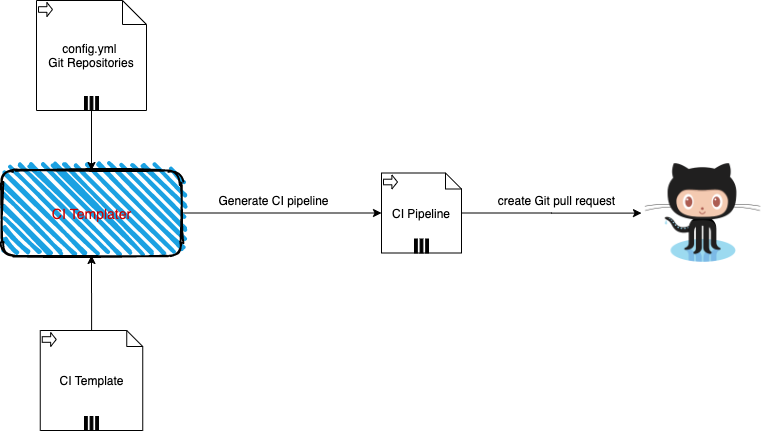

# CI Templater


This tool generate CI config for any given CI tool (Github Action, Circleci) from a given generic CI template. It ensures consistency of the CI template across all the deployments. This tool is particularly useful in the era of microservices architectural style whereby several microservices would share the same deployment pipeline. This tool allows us to generate ci config for all these services from a one given ci template. See the diagram below for the detailed flow:





## Why should you use this tool?

This CI templater ensures the followings:

* CI pipeline for all the deployments are generated from a `SINGLE` CI template. 
* Updates the CI pipeline for all deployments in one single run.
* Creates Pull requests for all updated deployment pipelines.


## Usage

This tool relies on two configuration files as input:

1. Configuration file defining all the deployments with their corresponding Git repos - see [config.yml](config.yml). See a snippet below

```
description: Generic template to generate github action configuration files for the repositories defined in the config file
repositories:
  - repo:
      url: https://github.com/cirtak/test_repo
      service_name: test_repo
      key1: value1
      key2: value2
      ....: .....
      keyn: valuen
  
```      

The above configuration file contains list of the Git repositories we aim to generate or update the CI pipeline for. The `url` is the only mandotory parameter. You can define as many parameters in the form of `key` and `value`.


2. Template file - This file contains the CI template from which instances of the CI piepline will be generated - see [Github action sample](templates/deploy-staging.yml).


Note that you can also define `templates` within the CI template - see [circleci pipeline example](templates/circleci-template.yml):

Declare the template as follow

```
{[define "DEPLOYMENT"]}

\\ something

{[end]}
```

Invoke the template for each environment as follow by passing the relevant parameters

```
{[template "DEPLOYMENT" map "Env" "dev" "Name" .service_name  "AWSAccountNumber" "xxx128601811" ]}
{[template "DEPLOYMENT" map "Env" "staging" "Name" .service_name "AWSAccountNumber" "xxx345174122" ]}
{[template "DEPLOYMENT" map "Env" "prod" "Name" .service_name  "AWSAccountNumber" "xxx2574511" ]}
```

## Running the tool

You can either checkout the ci-templater project or simply use the distributed binaries, see below details:

### `Using the distributed binaries`

a. Create a folder structure as shown in the [examples/github-action](examples/github-action) 

b. Download the [latest release from here](https://github.com/akhettar/ci-templater/releases/) and unzip the binary in the above folder

c. That is it, you are ready to go and following in the instruction below

d. Update the `config.yml` with all your target git repositories and add your CI templates in the `templates` folder. Remove the existing ones as they are just samples.

e. Run the tool with following command:./ci-templater

### `Checkout the whole project`

You can simply checkout the whole `ci-tempalte` project and update the `config.ymml` and `templates` with the relevant CI pipeline templates. Remove the existing ones as they are there as an example. Then follow the step below:


1. Export the following as environment variables

```
export GITHUB_TOKEN=xxx
export GPG_PASSWORD=xxx - only needed if GPG signing is enabled
export GITHUB_EMAIL=xxx - this is the email address associated with your git account
```


2. Generate GPG private key if GPG signing is enabled

You can generate the private key as follow. First, extract the `GPG secret key` by running the following command: 

`gpg --list-secret-keys --keyid-format LONG`

The output of the above should be something similar to this:

```
sec   rsa4096/B3FBB1D34AA9E501 2020-06-18 [SC] [expires: 2022-06-18]
      1A4945B7F183D631AB99D982B3FBB1D34AA9E501
uid                 [ultimate] ayache@cirta.dev <ayache@cirta.dev>
```

The secret key should be `B3FBB1D34AA9E501`


Then use the above secret key to generate GPG private key

```
gpg --armor --export-secret-keys ${ID} > gpg-private-key 
```

3. Now you can run the tool with the following command: `go build && ./ci-templater`


### `Run the tool in dry mode`

The default set up of this tool is that it creates a pull request for each generated template. You can disable this by setting the `DryRun` flag as follow when running the tool

` go build && ./ci-templater -DryRun=true`


### `Generating the template for only one given deployment`

By default the tool will extract the deployment details from `config.yml` then uses the appropriate template for each deployment. To apply the filter for only one deployment run the tool with the `repo` flag

`go build && ./ci-templater -repo=test_repo`


## Limitations

Currently, this tool assumes the generated ci pipelines are going to be pushed to Github repository. Support for other repositories will be added in due course. Enjoy!!

## LICENSE

[MIT](LICENSE)


